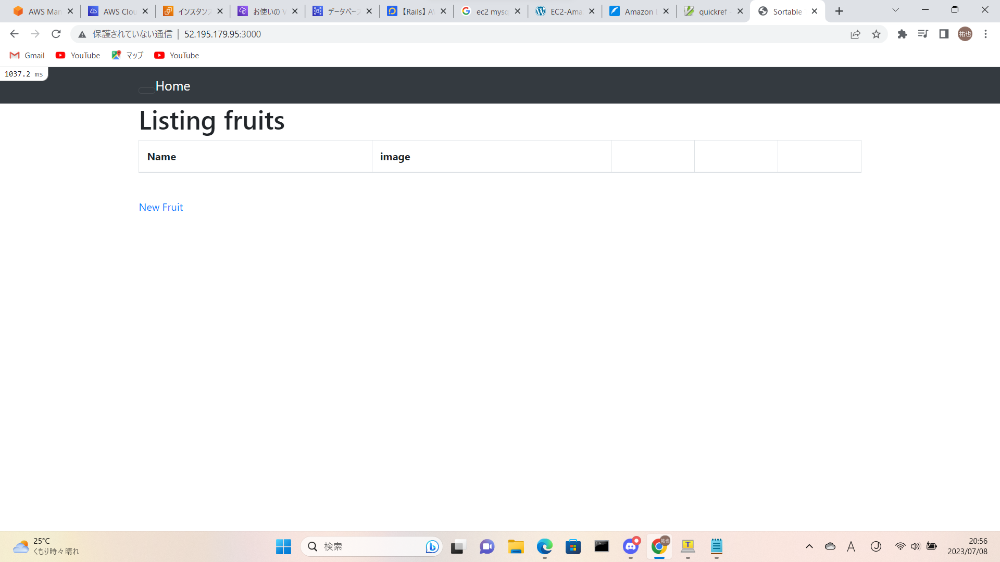
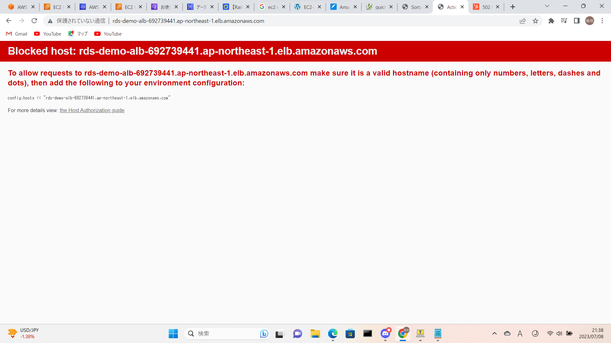
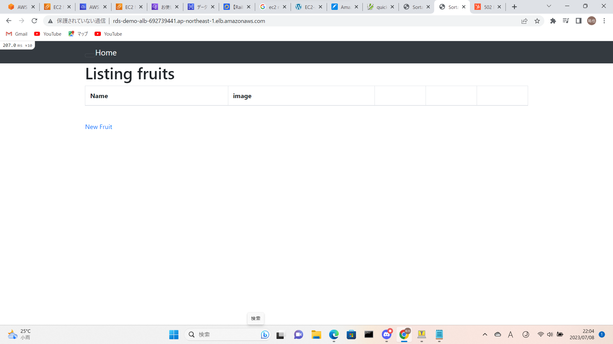
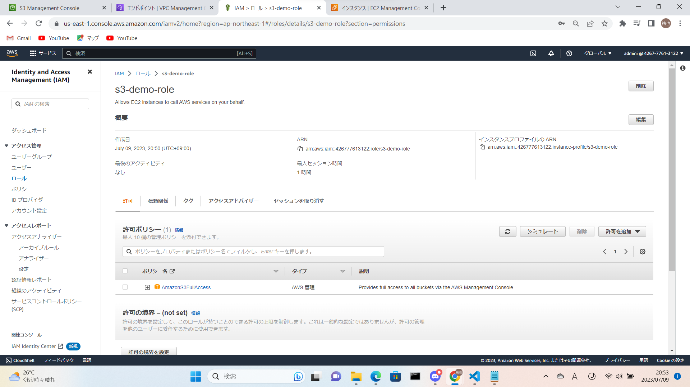
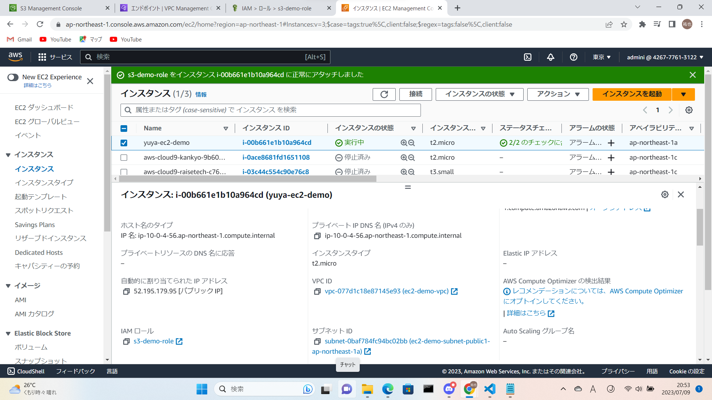
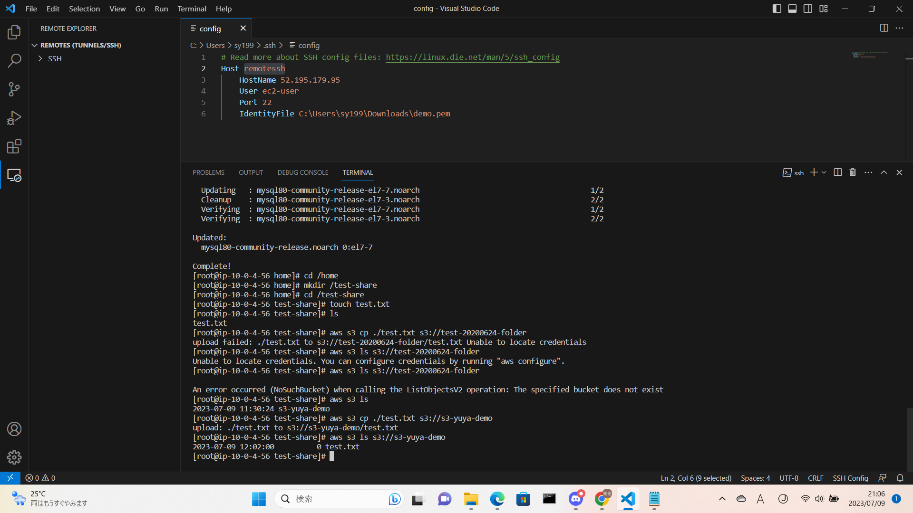
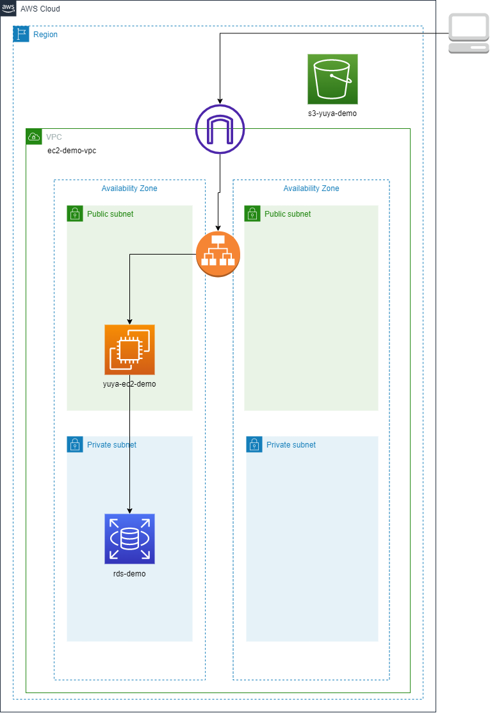

**第5回課題**

- EC2 上にサンプルアプリケーションをデプロイして、動作させてください。
 

- 動作したら、ELB(ALB)を追加してみましょう。
 

- ELB を加えて動作が確認できたら、さらに S3 を追加してみましょう。S3 をどのように使うかはお任せします。

- EC2 が使用できるロールを作成して、そのロールに s3 にアクセスできるポリシーを追加した。

- ここまでが問題無く動作したら、その環境を構成図に書き起こしてください。

