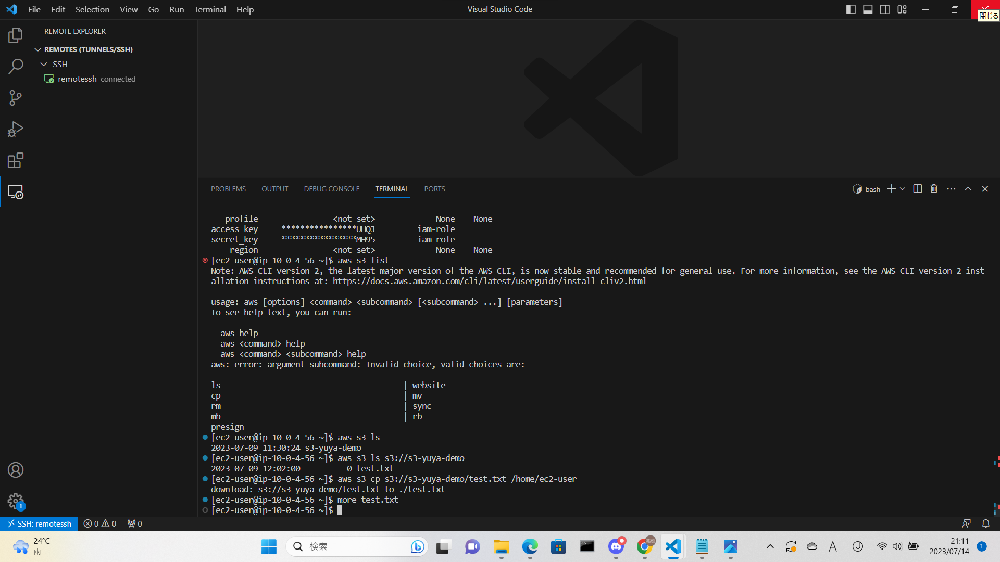

**第5回課題**

- EC2 上にサンプルアプリケーションをデプロイして、動作させてください。

- ec2にアプリケーションをデプロイした。
 

- 動作したら、ELB(ALB)を追加してみましょう。

- alb を追加したがエラーが出た。
 

- エラーを修正した。

- ELB を加えて動作が確認できたら、さらに S3 を追加してみましょう。S3 をどのように使うかはお任せします。

- EC2 が使用できるロールを作成した。そのロールに s3 にアクセスできるポリシーを追加した。

- ec2 に作成したロールをアタッチした。

- s3 をバケットとして使用する。ec2 で作成したテキストをs3 に追加した。

- s3 のオブジェクトをec2 にコピーした。
- データを往復して検証しています。

- ここまでが問題無く動作したら、その環境を構成図に書き起こしてください。
 
- draw.ioを使用して構成図を作成した。

